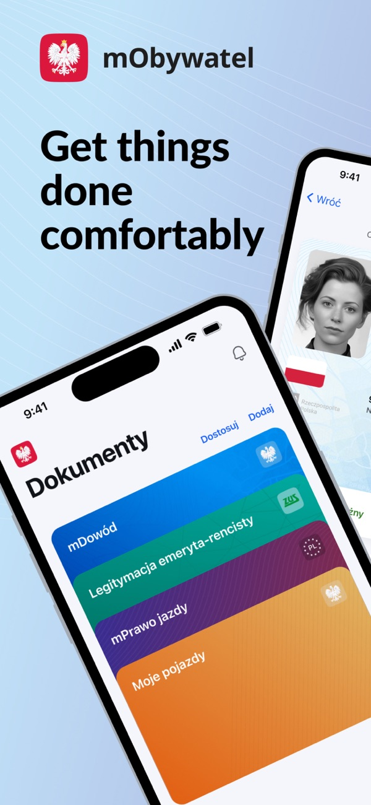
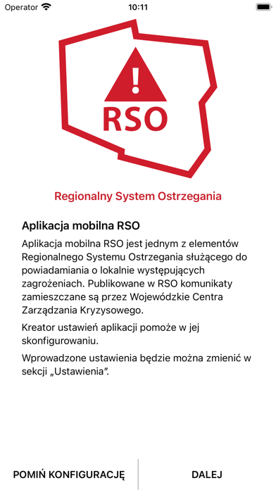
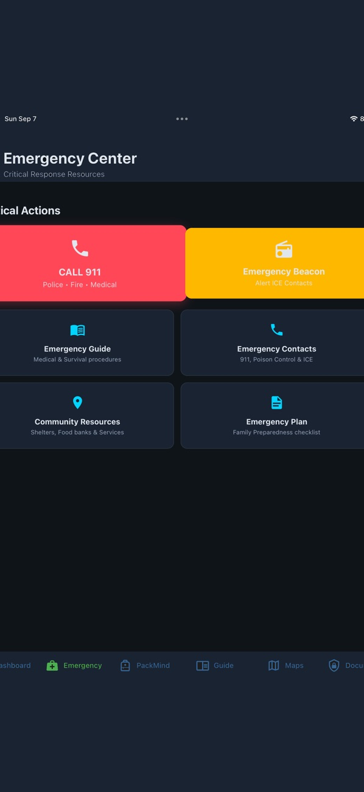
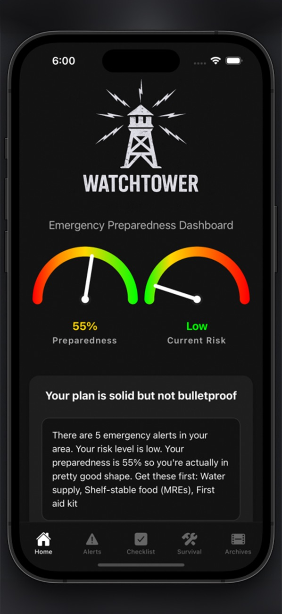
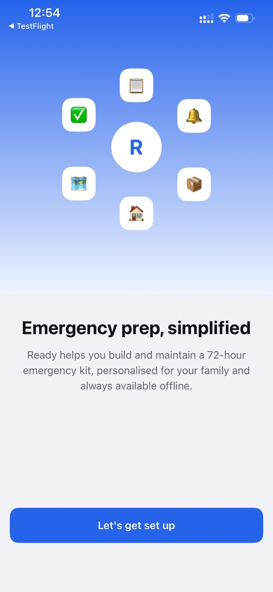

# Analogi: Household Resilience App

8 rozwiązań podobnych do naszego projektu (po selekcji z 15), po jednym screenie w katalogu każdego z nich. Numery pozycji są stałe z pierwotnej listy, więc w ciągu są luki. Pełna ocena i wnioski znajdują się w `analiza-zbiorcza.md`.

Obowiązującym źródłem prawdy dla warstwy wizualnej produktu jest [`JEZYK_WIZUALNY.md`](../../../JEZYK_WIZUALNY.md). Dokumenty i screeny w tym katalogu są materiałem badawczym oraz źródłem referencyjnym, nie specyfikacją UI.

**Uwagi:**

- Screeny to pierwszy obraz ze sklepu App Store, więc bywa to grafika marketingowa, a nie widok aplikacji.
- Brakuje screenu dla **Gdzie się ukryć** (strona blokuje boty, 403). Do zrobienia ręcznie.
- Wynik = średnia ważona 1–5 (dopasowanie 30%, użyteczność w kryzysie 25%, wartość dla preppersów 20%, popularność 15%, hackathon 10%). Popularność jest szacunkiem.

## Podsumowanie

| #   | Rozwiązanie                           | Region | Wynik | Screen                                          |
| --- | ------------------------------------- | ------ | ----: | ----------------------------------------------- |
| 01  | #wGotowości (MON)                     | PL     |  4,20 | `screeny/01-wGotowosci/`                        |
| 02  | Gdzie się ukryć (MSWiA/PSP)           | PL     |  4,15 | brak                                            |
| 03  | mObywatel, poradnik bezpieczeństwa    | PL     |  3,20 | `screeny/03-mObywatel/`                         |
| 04  | Regionalny System Ostrzegania (MSWiA) | PL     |  3,00 | `screeny/04-RSO-Regionalny-System-Ostrzegania/` |
| 07  | NomadCore                             | świat  |  3,75 | `screeny/07-NomadCore/`                         |
| 09  | Watchtower Survival Pro               | świat  |  3,25 | `screeny/09-Watchtower-Survival-Pro/`           |
| 10  | Ready: Emergency Kit Planner          | świat  |  2,65 | `screeny/10-Ready-Emergency-Kit-Planner/`       |
| 13  | Bridgefy                              | świat  |  3,10 | `screeny/13-Bridgefy/`                          |

## Polska

### 01. #wGotowości (MON), 4,20

Checklista plecaka ewakuacyjnego, plan rodzinny i poradnik bezpieczeństwa offline. Brakuje konkretnego planu rodziny, luk w gotowości i trybu działania.
[Źródło](https://www.chip.pl/2026/02/wgotowosci-to-nowa-aplikacja-mon-ktora-chce-nas-przygotowac-na-trudne-czasy)

### 02. Gdzie się ukryć (MSWiA/PSP), 4,15

Mapa ok. 83 tys. schronów z trasą, działa offline po pobraniu danych. Brakuje powiązania z rodziną, planu B i checklist. Nie budujemy własnej bazy, korzystamy z tej.
[Źródło](https://www.gov.pl/web/kppsp-pabianice/nowa-aplikacja-gdziesieukrycpl--pomoc-w-szybkim-znalezieniu-miejsca-schronienia-w-sytuacji-zagrozenia)

_Brak screenu._

### 03. mObywatel, poradnik bezpieczeństwa, 3,20

Poradnik GOV w aplikacji z największą bazą użytkowników. Zwykły poradnik, bez planu, mapy i trybu działania.
[Źródło](https://www.rmf24.pl/fakty/polska/news-poradnik-bezpieczenstwa-juz-dostepny-w-aplikacji-mobywatel,nId,8064171)

### 04. Regionalny System Ostrzegania (MSWiA), 3,00

Alerty i ostrzeżenia kryzysowe. Kandydat do integracji (alert → Execution Mode). Opis z wiedzy własnej, nie potwierdzony w wyszukiwaniu; do sprawdzenia, czy jest otwarte API.

## Globalne

### 07. NomadCore, 3,75

Plan rodziny, miejsca spotkań, lista grab-and-go, trasy ewakuacji, zapasy z alertami o terminach, mapy offline, udostępnianie przez QR. Najbliższy konkurent funkcjonalny. Nie ma polskich schronów ani alertów.
[Źródło](https://apps.apple.com/app/id6751544385)

### 09. Watchtower Survival Pro, 3,25

Alerty na żywo, checklisty go-bag, plan rodziny, ponad 50 poradników offline. Część funkcji wymaga sieci, nacisk na USA.
[Źródło](https://apps.apple.com/us/app/-/id6751219165)

### 10. Ready: Emergency Kit Planner, 2,65

Offline-first rejestr zapasów z przypomnieniami o terminach. Wzorzec dla preparedness decay.
[Źródło](https://apps.apple.com/app/id6760856696)

### 13. Bridgefy, 3,10

Komunikator Bluetooth mesh bez internetu. Kandydat do polecenia lub integracji jako fallback, gdy rodzina nie ma łączności.
[Źródło](https://techxlab.org/solutions/bridgefy/)

## Usunięte z listy

Siedem pozycji usunięto, bo mało wnoszą wobec zakresu PRD (plan rodziny, Execution Mode, schrony z istniejących systemów, alerty po MVP). Wyniki z pierwotnej oceny podano dla porównania. Rekomendacje, co z nich zachować, są w `analiza-zbiorcza.md` (sekcja „Usunięte z listy”).

| #   | Rozwiązanie                 | Wynik | Powód                                               |
| --- | --------------------------- | ----: | --------------------------------------------------- |
| 05  | Air Alert                   |  3,00 | tylko alerty (po MVP), brak planu                   |
| 06  | Kyiv Digital                |  2,45 | aplikacja jednego miasta                            |
| 08  | Survivalist: Survival Guide |  2,60 | ogólne przewodniki, checklisty mamy z innych źródeł |
| 11  | The Prepper App             |  2,90 | zapasy i podręczniki, funkcje niepotwierdzone       |
| 12  | Prepper AI                  |  2,30 | ogólna wiedza i czat AI, ryzyko halucynacji         |
| 14  | Briar                       |  2,70 | tylko komunikacja, brak iOS                         |
| 15  | HazAdapt                    |  1,95 | nastawiona na USA, słabo potwierdzona               |
